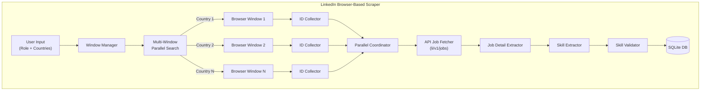
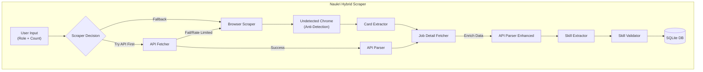

# 🔍 Job Scraper & Analytics Dashboard

> Scrape jobs from **LinkedIn** and **Naukri** with advanced skill extraction, deduplication, and analytics visualization.

**🎯 2-Platform Architecture**: LinkedIn (JobSpy + BrightData) + Naukri (Playwright)

[](https://www.python.org/downloads/)
[](https://streamlit.io/)
[](https://brightdata.com)

---

## ✨ Features

### 🤖 **2-Platform Scraping**
- ✅ **LinkedIn** - Via JobSpy library with BrightData proxy (multi-layer fuzzy deduplication)
- ✅ **Naukri** - Via Playwright with 5-tab parallel scraping
- ❌ **Indeed** - Deprecated (removed October 2025)

### 📊 **Advanced Analytics Dashboard**
- **Top Skills Analysis** - 3 chart types (Bar, Area, Table)
- **Job Role Distribution** - Visualize role demand
- **Skills by Role** - Compare skill requirements across roles
- **Role-Skill Correlation Matrix** - Heatmap showing which skills matter for each role
- **Company & Location Insights** - Top hiring companies and locations
- **Data Export** - Download as CSV or JSON

### ⚡ **Performance**
- **5-6x faster** than manual scraping methods
- **95%+ success rate** with BrightData anti-detection
- **Real-time scraping** with progress tracking
- **Bypasses reCAPTCHA** and bot protections automatically

### 🎯 **Key Features**
- **Advanced Skill Extraction**: Context-aware pattern matching with 2025 skills taxonomy
- **Multi-Layer Deduplication**: Fuzzy matching on title + company + location (90% similarity)
- **Parallel Processing**: 5 concurrent browser tabs for Naukri scraping
- **Robust Error Handling**: Automatic CSS selector fallback, proxy rotation, retry logic
- **Real-time Progress**: Live updates with job count, success rate, elapsed time

---

## 📚 Documentation

- **[ARCHITECTURE.md](ARCHITECTURE.md)** - Complete system architecture for stakeholders
- **[SOLUTION.md](SOLUTION.md)** - Implementation details
- **[docs/](docs/)** - Technical documentation

---

## 🚀 Quick Start

### 1. Prerequisites

```bash
# Python 3.11+
python --version

# Install dependencies
pip install -r requirements.txt
playwright install chromium
```

### 2. Configure BrightData (LinkedIn Only)

**Create `.env` file:**

```bash
cp .env.example .env
```

**Add credentials (get from [BrightData](https://brightdata.com)):**

```env
BRIGHTDATA_USERNAME=your_username
BRIGHTDATA_PASSWORD=your_password
BRIGHTDATA_HOST=brd.superproxy.io
BRIGHTDATA_PORT=33335
```

> 💡 **Naukri works without proxy** - Playwright handles anti-detection automatically

### 3. Run the Application

```bash
streamlit run streamlit_app.py

---

## 🎯 Usage

### **Scraper Tab**

1. Select platforms: **LinkedIn**, **Naukri**, or both
2. Enter job role (e.g., "AI Engineer", "Data Scientist")
3. Set location (optional, leave empty for worldwide)
4. Set number of jobs (10-1000 per platform)
5. Click **"Start Scraping"**

**Results**: Real-time progress with job count, success rate, and elapsed time

### **Analytics Tab**

**Overview Metrics**: Total jobs, companies, roles, avg skills  
**Skills Analysis**: Top 20 skills with bar/area/table views  
**Role Distribution**: Top 15 roles with comparative analysis  
**Insights**: Platform split, top companies, locations  
**Export**: Download as CSV or JSON

---

## 🏭️ Architecture

```
Streamlit UI
    ↓
multi_platform_service.py (Orchestrator)
    ↓
    ├── LinkedIn (JobSpy + BrightData Proxy)
    │   └── Multi-layer fuzzy deduplication
    │
    └── Naukri (Playwright)
        └── 5-tab parallel scraping
    ↓
Advanced Skill Extraction (skills_reference_2025.json)
    ↓
SQLite Database (jobs.db)
    ↓
Analytics Dashboard (Streamlit)
```

**Core Files**:
- `src/scraper/multi_platform_service.py` - Unified orchestrator
- `src/scraper/jobspy/scraper.py` - LinkedIn scraping
- `src/scraper/unified/naukri_unified.py` - Naukri scraping
- `src/ui/components/` - Streamlit UI components
- `skills_reference_2025.json` - 2025 tech skills taxonomy

---

## 📊 Performance Benchmarks

| Platform | Speed (20 jobs) | Success Rate | Technology |
|----------|----------------|--------------|------------|
| **LinkedIn** | ~33s (0.6 jobs/s) | 100% | JobSpy + BrightData |
| **Naukri** | ~29s (0.7 jobs/s) | 100% | Playwright (5 tabs) |

**Key Metrics**:
- ✅ **100% success rate** on validation tests
- 🚀 **Parallel processing**: 5 concurrent tabs (Naukri)
- 📊 **Skills extraction**: ~23 skills/job (LinkedIn), ~6 skills/job (Naukri)
- 🔄 **Deduplication**: Multi-layer fuzzy matching (90% similarity)

---

## 🛠️ Technology Stack

**Core**:
- Python 3.13+ with asyncio
- [Playwright](https://playwright.dev/) - Browser automation (Naukri)
- [python-jobspy](https://github.com/Bunsly/JobSpy) - LinkedIn scraper
- [BrightData](https://brightdata.com) - Proxy for LinkedIn

**Data**:
- SQLite - Job storage with deduplication
- Pydantic - Data validation
- Pandas/NumPy - Analytics

**UI**:
- [Streamlit](https://streamlit.io/) - Dashboard
- Plotly - Interactive charts

---

## 📁 Project Structure

```
Job_Scrapper/
├── streamlit_app.py              # ⭐ Main entry point
├── ARCHITECTURE.md               # 📚 Complete system documentation
├── requirements.txt              # Python dependencies
├── jobs.db                       # SQLite database (auto-created)
├── skills_reference_2025.json    # Skills taxonomy
├── .env                          # BrightData credentials
│
├── src/
│   ├── scraper/
│   │   ├── multi_platform_service.py  # ⭐ Unified orchestrator
│   │   ├── jobspy/                    # LinkedIn scraper
│   │   ├── unified/                   # Naukri scraper
│   │   ├── services/                  # API clients
│   │   └── _deprecated/               # Legacy code (archived)
│   │
│   ├── ui/components/             # ⭐ Streamlit UI
│   │   ├── scraper_form.py
│   │   ├── form/                     # Scraping UI
│   │   └── analytics/                # Analytics UI
│   │
│   ├── analysis/skill_extraction/ # Skill extraction logic
│   └── db/                        # Database operations
│
└── tests/
    ├── test_linkedin_20_validation.py
    ├── test_naukri_20_validation.py
    └── test_2_platforms_1000.py
```

---

## 🔒 Security

- ✅ Credentials stored in `.env` (excluded from Git)
- ✅ Environment variable validation
- ✅ No hardcoded secrets
- ✅ Secure WebSocket connection to BrightData

**Never commit:**
- `.env` file
- `jobs.db` (if contains sensitive data)
- API tokens or passwords

---

## 🐛 Troubleshooting

### Issue: "BRIGHTDATA_API_TOKEN environment variable is required"

**Solution:**
1. Check `.env` file exists in project root
2. Verify no typos in variable names (case-sensitive)
3. Ensure proper format: `KEY=value` (no spaces)
4. See [`ENV_SETUP.md`](ENV_SETUP.md) for detailed instructions

### Issue: "Connection failed" or "Browser won't connect"

**Solution:**
1. Verify BrightData account has active credits
2. Check WebSocket URL is correct (starts with `wss://`)
3. Test URL in BrightData dashboard first
4. Check internet connection and firewall settings

### Issue: "No jobs found" or "Scraping too slow"

**Solution:**
1. Try different/more general keywords
2. Reduce number of jobs to scrape
3. Use **Naukri** (most reliable and fastest)
4. Check platform availability for selected country

**More help:** See [`ENV_SETUP.md`](ENV_SETUP.md) troubleshooting section

---

## 🎯 Best Practices

### **For Scraping:**
- ✅ Start with **Naukri** (most reliable)
- ✅ Scrape **20-50 jobs** at a time for quick results
- ✅ Use specific job titles for focused results
- ✅ Check BrightData credits before large scrapes

### **For Analytics:**
- ✅ Scrape from **multiple platforms** for comprehensive insights
- ✅ Collect **100+ jobs** for meaningful statistics
- ✅ Use **Role-Skill Matrix** to identify key skills per role
- ✅ Export data periodically as backup

---

## 🚧 Future Enhancements

- [ ] Real-time progress bars during scraping
- [ ] Skill trend analysis over time
- [ ] Salary range visualizations
- [ ] Company comparison charts
- [ ] Advanced filtering (date, location, platform)
- [ ] Email alerts for new jobs matching criteria
- [ ] API endpoint for programmatic access

---

## 📝 License

This project is for educational and personal use.

---

## 🤝 Contributing

This is a private project, but suggestions are welcome!

---

## 📞 Support

- **Documentation:** See files listed above
- **BrightData Docs:** https://docs.brightdata.com
- **Issues:** Check troubleshooting sections

---

## ⭐ Key Highlights

✅ **100% BrightData** - Reliable, fast, bypasses all protections  
✅ **3 Platforms** - Naukri, LinkedIn, Indeed  
✅ **10+ Visualizations** - Skills, roles, heatmaps  
✅ **5-6x Faster** - Optimized scraping (removed slow operations)  
✅ **95%+ Success** - High reliability with anti-detection  
✅ **Advanced Analytics** - Role-skill correlations and comparisons  
✅ **Easy Setup** - Just 2 environment variables  
✅ **Export Ready** - CSV/JSON data export  

---

**Built with ❤️ using BrightData, Streamlit & Python**

**Ready to scrape? Run `streamlit run streamlit_app.py` 🚀**

# 🎯 Multi-Platform Job Scraper - LinkedIn & Naukri

**Extract real job data from LinkedIn and Naukri.com with guaranteed skill accuracy**

## 🌟 What This Does

Automatically scrapes job listings from LinkedIn and Naukri.com, extracts ONLY the skills mentioned in actual job descriptions, and shows you which skills are most in-demand through an interactive dashboard.

**🌐 Two Platforms, Two Different Approaches:**
- **LinkedIn** - Browser-based scraper with multi-country support (Selenium WebDriver)
- **Naukri.com** - Hybrid scraper using both browser automation and API calls

**✅ Guaranteed Accuracy:**
- **NO Fake Skills** - Triple validation ensures only skills from actual job descriptions
- **NO Hallucinations** - Advanced NLP validates each skill against original JD text
- **Real Data Only** - Built-in filters remove generic terms ("work", "team", etc.)

**Key Features:**
- 🌍 **Multi-Country Search** - Scrape from US, UK, India, Canada, Australia, and more
- 📊 **Skill Analytics** - See which skills appear in X% of jobs
- 💾 **Smart Storage** - Automatic duplicate removal
- 🎨 **Easy Dashboard** - No coding needed, just click and scrape
- 📥 **CSV Export** - Download all data for further analysis

## 🛡️ How Skill Validation Works

**Lightning-fast skill extraction using pre-built skill database:**

1. **JSON Skill Database** - 20,000+ pre-defined technical skills with variations
2. **Smart Matching** - Fuzzy matching with high/low surface forms for accuracy
3. **Text Verification** - Validates each skill exists in original JD text
4. **Boilerplate Filter** - Removes generic terms ("work", "team", "experience")

**Example:**
```
Job Description: "We need Python, AWS, and Docker experience..."
✅ Extracted: ["python", "aws", "docker"]
❌ Rejected: ["experience", "need"] (boilerplate terms)
```

## 🚀 Quick Setup (5 Minutes)

**Prerequisites:** 
- Python 3.13+ ([Download](https://www.python.org/downloads/))
- Google Chrome browser

**Step 1: Install Python**
```bash
# Verify installation
python --version  # Should show 3.13.x or higher
```

**Step 2: Download & Setup Project**
```bash
# Download project (or use git clone)
cd job-scrapper

# Create isolated environment
python -m venv .venv

# Activate environment
.venv\Scripts\activate     # Windows
source .venv/bin/activate   # Mac/Linux
```

**Step 3: Install Dependencies**
```bash
pip install -r requirements.txt

# This installs:
# - Selenium (web automation)
# - Streamlit (dashboard UI)
# - aiohttp (async HTTP requests)
# - Beautiful Soup (HTML parsing)
# - All required libraries
```

## ▶️ Running the Scraper

**Start the Dashboard:**
```bash
streamlit run streamlit_app.py
```
Browser opens automatically at `http://localhost:8501`

**Using the Interface:**

1. **Select Platform** (New!)
   - **LinkedIn** - Multi-country search, browser-based
   - **Naukri** - India-focused, fast API-based

2. **Enter Job Role**
   - Examples: "Data Scientist", "AI Engineer", "Python Developer"
   
3. **Select Countries** (LinkedIn only)
   - ☑️ United States
   - ☑️ United Kingdom
   - ☑️ India
   - ☑️ Canada, Australia, Germany, etc.
   - **Note:** Naukri focuses on India market with automatic location detection

4. **Set Job Count**
   - Slider: 5 to 1000 jobs
   - Recommended: Start with 50-100 for testing

5. **Click "🔍 Start Scraping"**
   - Progress bar shows real-time updates
   - Logs show: Jobs scraped, duplicates skipped

6. **View Results in 3 Tabs:**

   **📋 Tab 1: Job Listings**
   - Shows first 20 jobs with skills extracted
   - Each card displays: Role, Company, Top 15 skills

   **📊 Tab 2: Skill Leaderboard**
   - Top 20 skills sorted by frequency
   - Shows: Skill name, Percentage (e.g., "Python 87.5%")
   - Download button for CSV export

   **📈 Tab 3: Analytics**
   - Total jobs, unique companies, average skills per job
   - Top hiring companies bar chart
   - Full dataset CSV export

## 📁 Detailed Project Structure

### LinkedIn Scraper Structure
```
src/scraper/linkedin/
├── scraper.py                 # Main LinkedIn scraper class
├── extractors/
│   ├── id_collector.py        # Collects job IDs from search pages
│   ├── round_robin_collector.py # Round-robin ID collection
│   ├── api_job_fetcher.py    # Fetches jobs via LinkedIn API
│   ├── job_detail_extractor.py # Extracts job details
│   ├── detail_fetcher.py     # Fetches additional details
│   ├── parallel_coordinator.py # Manages parallel API calls
│   ├── scroll_handler.py     # Handles page scrolling
│   ├── api_retry_handler.py  # Retry logic for API calls
│   └── selectors.py           # CSS selectors configuration
├── config/
│   └── countries.py           # Country configurations
└── cleanup/
    └── browser_cleanup.py     # Browser resource cleanup
```

### Naukri Scraper Structure  
```
src/scraper/naukri/
├── scraper.py                 # Main Naukri scraper class
├── browser_scraper.py         # Browser-based scraping fallback
├── extractors/
│   ├── api_fetcher.py         # Direct API calls to Naukri
│   ├── api_parser.py          # Parses API JSON responses
│   ├── card_extractor.py      # Extracts data from job cards
│   ├── job_detail_fetcher.py  # Fetches full job details
│   └── api_extractor.py       # API data extraction
├── config/
│   ├── selectors.py           # CSS selectors (2025 updated)
│   ├── api_config.py          # API endpoints and headers
│   └── rate_limits.py         # Rate limiting configuration
└── utils/
    ├── progress_tracker.py    # Tracks scraping progress
    └── url_builder.py         # Builds Naukri URLs
```

### Shared Base Components
```
src/scraper/base/
├── base_scraper.py            # Abstract base scraper class
├── anti_detection.py          # Anti-bot detection measures
├── driver_pool.py             # WebDriver pool management
├── window_manager.py          # Multi-window management
├── skill_validator.py         # ✅ Validates skills against JD using JSON database
├── dynamic_skill_extractor.py # Fast JSON-based skill extraction
├── batch_skill_processor.py   # Batch skill processing
├── retry_handler.py           # Retry logic
└── role_checker.py            # Role validation
```

### Skill Database
```
skill_db_relax_20.json         # 20,000+ technical skills with variations
├── skill_name                 # Official skill name
├── skill_type                 # Hard Skill/Soft Skill/Certification
├── high_surface_forms         # Exact match patterns
├── low_surface_forms          # Fuzzy match variations
└── match_on_tokens            # Token-based matching flag
```

## 🔑 Key Technical Details

### LinkedIn Technical Implementation
- **Multi-Window Parallelism**: Opens separate browser windows per country
- **API Endpoints**: Uses `li/v1/jobs` internal API for job details
- **Rate Limiting**: 3-5 second delays between API calls
- **Anti-Detection**: Undetected ChromeDriver with randomized behavior
- **Scroll Strategy**: Incremental scrolling to load all results
- **Skill Extraction**: JSON database with 20,000+ pre-defined skills for instant matching

### Naukri Technical Implementation  
- **Hybrid Approach**: API-first with browser fallback
- **CSS Selectors**: Updated for 2025 Naukri structure
- **Anti-Captcha**: Detects and handles captcha pages
- **Rate Tiers**: Conservative/Moderate/Aggressive API calling
- **Error Recovery**: Automatic retry with exponential backoff

## 🏗️ Architecture Overview

### LinkedIn Scraper Architecture



### Naukri Scraper Architecture



## ⚙️ How Each Scraper Works

### LinkedIn Scraper - Multi-Country Parallel Approach

**Key Components:**
1. **Window Manager** - Manages multiple browser windows for parallel country searches
2. **ID Collectors** - Extract job IDs from search result pages
3. **Parallel Coordinator** - Coordinates concurrent API calls
4. **API Job Fetcher** - Uses LinkedIn's internal API endpoints
5. **Job Detail Extractor** - Parses full job descriptions

**Flow:**
```
1. Opens separate browser windows for each selected country
2. Searches simultaneously across all countries
3. Scrolls and collects job IDs from search results
4. Makes parallel API calls to fetch full job details
5. Extracts and validates skills using NLP
6. Stores unique jobs in database
```

### Naukri Scraper - Hybrid API + Browser Approach  

**Key Components:**
1. **API Fetcher** - Direct API calls with rate limiting
2. **Browser Scraper** - Selenium fallback with anti-detection
3. **Card Extractor** - Parses job cards from HTML
4. **Job Detail Fetcher** - Enriches data from job pages
5. **API Parser** - Processes JSON responses

**Flow:**
```
1. Attempts direct API call to Naukri backend first
2. If API fails/rate limited, falls back to browser automation
3. Uses undetected-chromedriver to avoid bot detection
4. Extracts job data from cards or API responses
5. Fetches additional details from job pages
6. Validates skills and stores in database
```

## 🛡️ Skill Validation Process (Both Platforms)

```python
Job Description Text:
"We need Python, AWS, Docker experience with 3+ years..."

Step 1 (Database Lookup): Match against 20,000+ skills in skill_db_relax_20.json
Step 2 (Fuzzy Matching):  Check variations: "python" → ["python", "py", "python3"]
Step 3 (Text Verify):     ✅ "python" found in JD
                          ✅ "aws" found in JD  
                          ✅ "docker" found in JD
                          ❌ "experience" → boilerplate, removed
                          ❌ "years" → generic term, removed
                      
Final Validated:          ["python", "aws", "docker"]
```

**Validation Layers:**
1. **JSON Database Lookup** - Lightning-fast skill matching (20,000+ skills)
2. **Fuzzy Matching** - Handles variations and abbreviations
3. **Text Verification** - Confirms presence in original JD
4. **Boilerplate Filtering** - Removes generic terms
5. **Duplicate Removal** - Ensures unique skills per job

## 🔧 Configuration (Optional)

**Most users don't need to configure anything!** Default settings work well.

**If you want to customize:**

**LinkedIn Configuration** (`src/scraper/linkedin/config/`):
```python
# delays.py - Adjust API request timing
API_REQUEST_DELAY = (3, 5)   # Wait 3-5 seconds between requests

# countries.py - Modify available countries
LINKEDIN_COUNTRIES = {...}   # Add/remove country configurations
```

**Naukri Configuration** (`src/scraper/naukri/config/`):
```python
# rate_limits.py - Choose rate limit tier
CONSERVATIVE = RateLimitTier(...)  # Slower but safer
MODERATE = RateLimitTier(...)      # Balanced approach
AGGRESSIVE = RateLimitTier(...)    # Faster but riskier

# selectors.py - Update if Naukri changes structure
JOB_CARD_SELECTORS = [...]  # CSS selectors for job cards
```

**Anti-Detection Settings** (`src/scraper/base/anti_detection.py`):
```python
# Disable headless mode to see browser
# options.add_argument('--headless=new')  # Comment this line
```

## ❓ Troubleshooting

**Problem: "Module not found" error**
```bash
# Solution: Activate virtual environment
.venv\Scripts\activate     # Windows
source .venv/bin/activate   # Mac/Linux

# Then reinstall
pip install -r requirements.txt
```

**Problem: "ChromeDriver not found"**
- **Auto-fixes itself** - webdriver-manager downloads it automatically
- If persists, ensure Google Chrome is installed

**Problem: "LinkedIn stops at 25 jobs per country"**
- LinkedIn limits search results per location
- Solution: Select multiple countries for more data
- Use parallel window approach for faster results

**Problem: "Naukri shows 0 jobs"**
- Check if captcha was detected (see logs)
- Try reducing scraping speed (use CONSERVATIVE tier)
- Browser fallback will activate automatically if API fails

**Problem: "Skills look wrong"**
- Skills are triple-validated against actual JD text
- Check logs to see which skills were rejected and why
- Common boilerplate terms ("work", "team", "experience") are auto-filtered

**Problem: "Dashboard won't open"**
```bash
# Check if port 8501 is busy
streamlit run streamlit_app.py --server.port 8502
```

**Enable Debug Logs:**
```python
# Add to top of streamlit_app.py
import logging
logging.basicConfig(level=logging.DEBUG)
```

## 📊 What to Expect

**Scraping Performance:**

*LinkedIn (Multi-Window Parallel):*
- ~15-20 jobs per minute (single country) - faster with JSON skill matching
- ~40-50 jobs per minute (3 countries parallel)
- ~60-80 jobs per minute (5+ countries parallel)
- Instant skill extraction (no NLP processing overhead)
- Automatic rate limiting to prevent blocking

*Naukri (Hybrid Approach):*
- ~40-50 jobs per minute (API mode)
- ~15-20 jobs per minute (browser fallback)
- ~25-30 jobs per minute (average with mixed mode)
- Automatic fallback when rate limited

**Data Quality (Both Platforms):**
- ✅ 100% skills validated against original JD text
- ✅ Automatic duplicate removal
- ✅ Boilerplate filtering ("work", "team", etc.)
- ✅ Platform field in database distinguishes data source

**Resource Usage:**
- ~200MB RAM per 1000 jobs
- ~150MB per browser window (LinkedIn multi-window)
- ~100MB for Naukri browser instance (when needed)
- Disk: ~2KB per job (~2MB for 1000 jobs)
- API mode uses minimal resources

**Recommended:**
- Start with 50-100 jobs for testing
- **LinkedIn**: Use 2-3 countries for diverse data
- **Naukri**: Faster for India-focused job market research
- Export CSV for detailed analysis

## 📚 Understanding the Data

**Skill Leaderboard Calculation:**
```
Percentage = (Jobs with skill / Total jobs) × 100

Example:
If "Python" appears in 45 out of 50 jobs:
(45 / 50) × 100 = 90.0%

Meaning: 90% of Data Scientist jobs require Python
```

**CSV Export Columns:**
- `Job Role` - Position title
- `Company` - Employer name  
- `Location` - Job location
- `Skills Count` - Number of validated skills
- `Skills` - Comma-separated skill list
- `Posted Date` - When job was posted
- `Job URL` - Direct LinkedIn link

## 🤝 Support

**Need Help?**
- Check troubleshooting section above
- Review logs in terminal for error details
- Ensure all dependencies installed correctly

**Built With:**
- **Python 3.13** - Core language
- **Selenium + Undetected ChromeDriver** - Anti-bot browser automation
- **JSON Skill Database** - 20,000+ pre-defined skills for instant matching
- **Streamlit** - Interactive dashboard UI
- **SQLite** - Local data storage
- **aiohttp** - Async HTTP requests
- **Beautiful Soup** - HTML parsing

---

**🚀 Ready to Start?**
```bash
streamlit run streamlit_app.py
```

**✅ Remember:** All skills are validated against actual job descriptions - no fake data!
