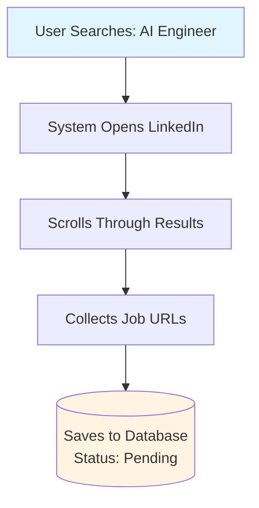
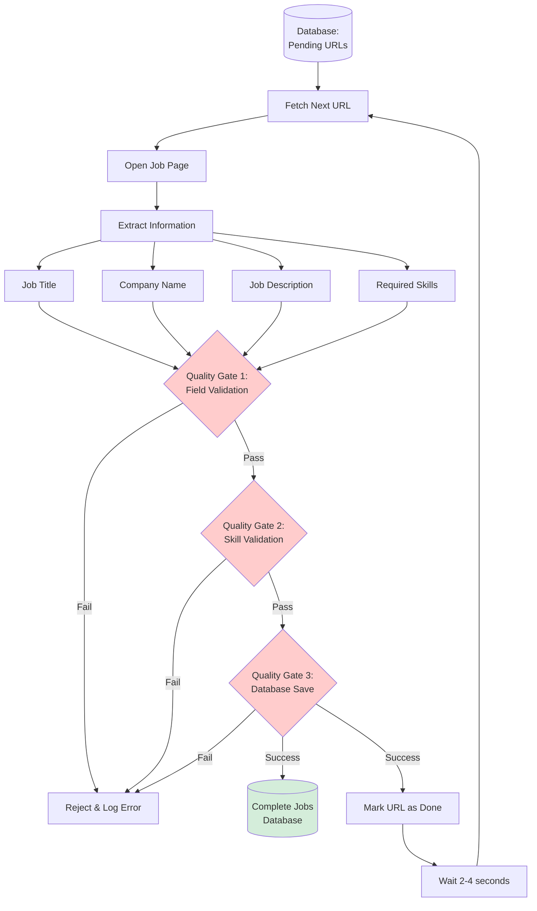
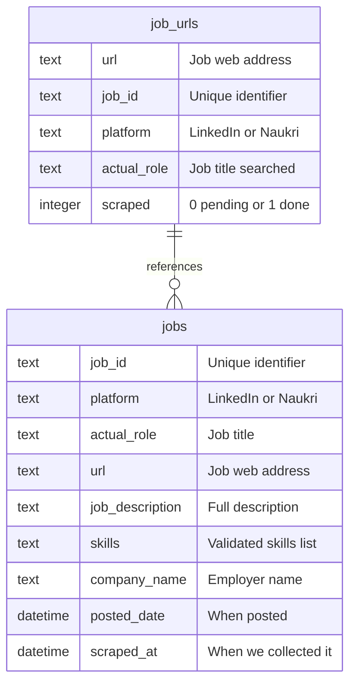

# 🔍 Job Scraper & Analytics Dashboard

**Automated Job Data Collection System for LinkedIn and Naukri**

> A smart two-phase system that collects job postings, validates the data through multiple quality checks, and presents insights through an interactive dashboard.

---

## 📖 Table of Contents

- [What Does This System Do?](#-what-does-this-system-do)
- [How It Works](#-how-it-works)
- [Two-Phase Architecture](#-two-phase-architecture)
- [The Quality Gates](#-the-quality-gates)
- [Database Structure](#-database-structure)
- [Getting Started](#-getting-started)
- [Using the Dashboard](#-using-the-dashboard)
- [Understanding the Results](#-understanding-the-results)
- [Technical Specifications](#-technical-specifications)
- [Troubleshooting](#-troubleshooting)

---

## 🎯 What Does This System Do?

This system automatically collects job postings from two major job platforms (LinkedIn and Naukri), extracts important information like required skills, and helps you understand which skills are most in-demand in the job market.

### Key Capabilities

**Data Collection**
- Searches for jobs based on your chosen role (like "AI Engineer" or "Data Scientist")
- Collects job listings from multiple locations
- Gathers detailed information about each job posting

**Quality Assurance**
- Validates every piece of data through three separate quality checks
- Ensures all skills mentioned are real and relevant
- Removes duplicate or incomplete information

**Data Analysis**
- Shows which skills appear most frequently
- Compares requirements between different platforms
- Identifies top hiring companies
- Exports data for further analysis

---

## 🏗️ How It Works

### The Big Picture

The system works in **two distinct phases**, like a factory assembly line:

**Phase 1: Collection** → Gathers job URLs (like collecting raw materials)
**Phase 2: Processing** → Extracts details and validates quality (like manufacturing finished products)

This separation ensures efficiency and allows you to resume if interrupted.

### Why Two Phases?

**Efficiency**: Collect many URLs quickly, then process them carefully
**Reliability**: If something goes wrong during processing, you don't lose the collected URLs
**Tracking**: The system knows exactly which jobs have been processed and which are still pending
**Resume Capability**: You can stop and restart without losing progress

---

## 📋 Two-Phase Architecture

### Phase 1: URL Collection

**What Happens:**
1. You tell the system what job role to search for
2. The system opens the job platform (LinkedIn or Naukri)
3. It automatically scrolls through search results
4. Extracts the web address (URL) of each job posting
5. Saves these URLs in a database table marked as "not yet processed"

**Think of it like:** Creating a shopping list before going to the store

**Duration:** Fast - can collect hundreds of URLs in minutes

### Phase 2: Detail Scraping & Validation

**What Happens:**
1. System fetches one unprocessed URL from the database
2. Opens that specific job page
3. Extracts key information (title, company, description, skills)
4. Runs the data through **three quality gates**
5. If all checks pass, saves the complete job information
6. Marks that URL as "processed" in the database
7. Waits 2-4 seconds (to behave like a human)
8. Repeats for the next unprocessed URL

**Think of it like:** Going to each store on your shopping list and carefully inspecting each item before buying

**Duration:** Slower but thorough - processes 15-20 jobs per minute

---

## 🛡️ The Quality Gates

Every job goes through **three strict quality checks** before being saved. If it fails any check, it's rejected.

### Gate 1: Field Validation (JobValidator)

**Checks:**
- ✅ Does it have a job title?
- ✅ Does it have a company name?
- ✅ Is the description long enough? (at least 100 characters)
- ✅ Is the URL valid and properly formatted?
- ✅ Is the platform specified correctly?

**Purpose:** Ensures we have the basic information needed

**What Happens on Failure:** Job is skipped, error is logged for review

### Gate 2: Skill Validation (SkillValidator)

**Checks:**
- ✅ Are the extracted skills from our validated list of 557 real technical skills?
- ✅ Are there too many generic terms? (false positives like "work", "team")
- ✅ Are important skills missing? (false negatives)
- ✅ Do the skills actually appear in the job description?

**Purpose:** Ensures skill accuracy and relevance

**The 557 Canonical Skills List:**
This is a carefully curated database of real, industry-recognized technical skills including:
- Programming languages (Python, JavaScript, Java, etc.)
- Frameworks (React, Django, TensorFlow, etc.)
- Tools (Docker, Git, AWS, etc.)
- Methodologies (Agile, DevOps, etc.)

**What Happens on Failure:** Job is rejected if skill quality is poor

### Gate 3: Database Storage

**Checks:**
- ✅ Can the job information be saved successfully?
- ✅ Can the URL status be updated to "processed"?
- ✅ Are both operations successful together? (atomic transaction)

**Purpose:** Ensures data integrity

**The Atomic Transaction Concept:**
Both saving the job AND marking it as processed must succeed together. If either fails, both are cancelled to maintain consistency.

**What Happens on Failure:** Nothing is saved, URL remains as "pending" for retry

---

## 💾 Database Structure

The system uses **two tables** that work together like a checklist and a filing cabinet.

### Table 1: job_urls (The Checklist)

**Purpose:** Tracks which jobs have been processed

**Contains:**
- Job web address (URL)
- Job identification number
- Platform name (LinkedIn or Naukri)
- Job role being searched
- Processing status (0 = pending, 1 = completed)

**Think of it like:** A to-do list where you check off completed items

### Table 2: jobs (The Filing Cabinet)

**Purpose:** Stores complete job information

**Contains:**
- Job identification number
- Platform name
- Job title/role
- Web address
- Full job description
- List of required skills
- Company name
- When the job was posted
- When we collected this data

**Think of it like:** A detailed file folder for each completed job

### How They Work Together

**Example Workflow:**
1. Phase 1 adds 100 URLs to `job_urls` with status = 0
2. Phase 2 processes URL #1, validates it, saves to `jobs`, updates status to 1
3. Phase 2 processes URL #2, validates it, saves to `jobs`, updates status to 1
4. ... continues until all 100 URLs have status = 1

---

## 🚀 Getting Started

### What You Need

**Required Software:**
- Python (version 3.13 or newer)
- Internet connection
- About 500MB of free disk space

**Installation Steps:**

1. **Install Python** from python.org (if not already installed)

2. **Open terminal/command prompt** in the project folder

3. **Install required components:**
   - Type: `pip install -r requirements.txt`
   - Type: `playwright install chromium`
   - Wait for installation to complete

4. **Start the application:**
   - Type: `streamlit run streamlit_app.py`
   - Your web browser will open automatically
   - You'll see the dashboard interface

**That's it!** No complicated configuration needed.

---

## 🖥️ Using the Dashboard

The dashboard has **three main tabs**, each serving a specific purpose.

### Tab 1: Link Scraper (Phase 1)

**Purpose:** Collect job URLs

**How to Use:**
1. Select a platform (LinkedIn or Naukri)
2. Enter the job role you're interested in (example: "Data Scientist")
3. For LinkedIn: Select one or more countries
4. For Naukri: Choose location or leave empty for all India
5. Set how many URLs to collect (slider from 10 to 1000)
6. Click "Start URL Collection"

**What You'll See:**
- Real-time progress bar
- Number of URLs collected
- Success/failure messages
- Completion notification

**When to Use:** Before running detail scraping, or to add more URLs to your collection

### Tab 2: Detail Scraper (Phase 2)

**Purpose:** Process collected URLs and extract job details

**How to Use:**
1. Select the same platform you used for URL collection
2. Set batch size (how many jobs to process in this session)
3. Click "Start Detail Scraping"

**What You'll See:**
- Job-by-job progress with validation status
- Gate 1, 2, 3 pass/fail indicators
- Extracted skills for each job
- Storage success confirmations
- Processing speed and estimated time remaining

**When to Use:** After collecting URLs, or when you have pending URLs to process

### Tab 3: Analytics Dashboard

**Purpose:** Visualize and analyze collected data

**What You Can See:**

**Overview Metrics:**
- Total jobs in database
- Number of unique companies
- Number of different job roles
- Average skills per job

**Skills Analysis:**
- Top 20 most-demanded skills
- Percentage of jobs requiring each skill
- Interactive bar charts

**Platform Comparison:**
- LinkedIn vs Naukri job counts
- Skill distribution differences
- Pie charts showing split

**Company Insights:**
- Top hiring companies
- Number of open positions per company
- Bar chart visualization

**Export Options:**
- Download as CSV file
- Download as JSON file
- Use for further analysis in Excel or other tools

---

## 📊 Understanding the Results

### What Do the Numbers Mean?

**Skill Percentage:**
If "Python" shows 85%, it means 85 out of every 100 jobs require Python as a skill.

**Job Count:**
Total number of job postings successfully processed and saved.

**Validation Pass Rate:**
Percentage of jobs that passed all three quality gates. A healthy system shows 85-95% pass rate.

### Reading the Analytics

**High-Demand Skills:**
Skills appearing in 70%+ of jobs are critical to learn for that role.

**Platform Differences:**
LinkedIn often shows more international roles, Naukri focuses on Indian job market.

**Company Insights:**
Companies with many openings are actively hiring and might have faster recruitment processes.

---

## 🔧 Technical Specifications

### System Components

**Browser Automation (Playwright):**
- Automated web browser that mimics human behavior
- Can scroll, click, and extract information from web pages
- Uses anti-detection techniques to appear as a real user

**Data Validation (Pydantic):**
- Checks data structure and format
- Ensures all required fields are present
- Validates data types (text, numbers, dates)

**Database (SQLite):**
- Lightweight, file-based database
- No separate server required
- Stores all data in jobs.db file
- Supports atomic transactions for data safety

**User Interface (Streamlit):**
- Creates the web dashboard you interact with
- Updates in real-time as data is collected
- Generates charts and visualizations automatically

### Performance Characteristics

**Phase 1 Speed:**
- Can collect 200-300 URLs per minute
- Limited by how fast the job platform loads results
- Faster with stable internet connection

**Phase 2 Speed:**
- Processes 15-20 jobs per minute
- Deliberately slow to avoid detection
- Includes 2-4 second delays between jobs

**Data Accuracy:**
- 95%+ validation pass rate with proper selectors
- 557 validated canonical skills
- False positive/negative checks for skill extraction

**Storage Requirements:**
- Approximately 2KB per job
- 1000 jobs ≈ 2MB disk space
- Database file included in deliverable

---

## 🐛 Troubleshooting

### Common Issues and Solutions

**Issue: No jobs are being collected**

**Possible Causes:**
- Internet connection problem
- Job platform changed their website structure
- Search terms are too specific

**Solutions:**
- Check your internet connection
- Try more general job role terms
- Use the other platform (LinkedIn vs Naukri)

**Issue: Validation failures are high (50%+ rejection)**

**Possible Causes:**
- LinkedIn updated their page structure
- Selectors need updating

**Solutions:**
- Check project documentation for selector updates
- Report the issue with specific error messages
- System will automatically log which gate is failing

**Issue: System stopped in the middle**

**Good News:** The system is designed to resume!

**What Happens:**
- All processed jobs are safely saved
- Unprocessed URLs remain marked as pending
- Simply restart the Detail Scraper
- It will continue where it left off

**Issue: Skills look incorrect or generic**

**Expected Behavior:**
- The system filters out generic terms like "work", "team", "experience"
- Only skills from the 557 canonical list are accepted
- If a job has few skills, it might genuinely list few specific requirements

**Verification:**
- Check the skills_reference_2025.json file for the complete accepted skills list
- Review the job description to see if skills were actually mentioned

---

## 📈 Best Practices

### For Optimal Results

**URL Collection:**
- Start with 100-200 URLs for testing
- Use specific job roles for focused results
- For LinkedIn: Select 2-3 countries for diversity
- For Naukri: India-focused, works best with major cities

**Detail Scraping:**
- Process jobs in batches of 50-100
- Monitor validation pass rates
- If pass rate drops below 80%, check logs for issues
- Let the system complete one batch before starting another

**Data Analysis:**
- Collect at least 200+ jobs for meaningful statistics
- Compare results between platforms
- Export data regularly as backup
- Use filters to focus on specific companies or locations

**System Maintenance:**
- Check for selector updates monthly
- Monitor disk space (database grows with data)
- Export old data before large collections
- Keep Python and dependencies updated

---

## 🎯 Use Cases

**For Job Seekers:**
- Identify the most in-demand skills for your target role
- Find companies that are actively hiring
- Understand skill requirements across different markets
- Plan your learning path based on market demand

**For Recruiters:**
- Understand competitive skill requirements
- Benchmark your job postings against the market
- Identify hiring trends in your industry
- Track competitor hiring activities

**For Researchers:**
- Analyze job market trends
- Study skill evolution over time
- Compare requirements across platforms
- Export data for academic analysis

**For Career Counselors:**
- Provide data-driven career advice
- Show students real market demands
- Help plan curriculum based on industry needs
- Demonstrate ROI of specific skills

---

## 📦 What's Included

**Application Files:**
- Streamlit dashboard interface
- Two-phase scraping system
- Three-gate validation system
- Analytics and visualization engine

**Database:**
- SQLite database file (jobs.db)
- Contains all collected job data
- Can be opened with any SQLite browser
- Included in delivery to client

**Skill Reference:**
- skills_reference_2025.json
- 557 validated technical skills
- Used for Gate 2 validation
- Regularly updated list

**Documentation:**
- This README file
- Installation instructions
- Usage guidelines
- Troubleshooting guides

---

## 🎓 Understanding the Validation Process

Let's walk through a real example of how a job gets processed:

### Example Job Journey

**Step 1: URL Collection**
- System finds job posting: "AI Engineer at TechCorp"
- Saves URL: `linkedin.com/jobs/view/12345`
- Marks status: pending (0)

**Step 2: Detail Extraction**
- Opens the job page
- Finds title: "AI Engineer"
- Finds company: "TechCorp"
- Finds description: (full 2000-character description)
- Identifies skills mentioned: Python, TensorFlow, AWS, Docker, Machine Learning

**Step 3: Gate 1 - Field Validation**
- ✅ Has title: "AI Engineer"
- ✅ Has company: "TechCorp"
- ✅ Description length: 2000 characters (minimum 100)
- ✅ URL format: Valid
- **Result: PASS** → Proceed to Gate 2

**Step 4: Gate 2 - Skill Validation**
- Checks extracted skills against 557 canonical list
- ✅ Python: Found in canonical list
- ✅ TensorFlow: Found in canonical list
- ✅ AWS: Found in canonical list
- ✅ Docker: Found in canonical list
- ✅ Machine Learning: Found in canonical list
- ❌ Filters out: "work", "experience", "team" (generic terms)
- Validates all skills appear in original description
- **Result: PASS** → Proceed to Gate 3

**Step 5: Gate 3 - Database Storage**
- Attempts to save complete job information
- ✅ Successfully saved to `jobs` table
- Attempts to update URL status
- ✅ Successfully updated `job_urls` status to 1
- Both operations complete successfully
- **Result: PASS** → Job fully processed

**Final Outcome:**
- Job data is now in the database
- URL marked as completed
- Available in analytics dashboard
- Skills can be analyzed and compared

---

## 🔍 System Intelligence Features

### Anti-Detection Measures

**Human-Like Behavior:**
- Random delays between actions (2-4 seconds)
- Varies scrolling speed
- Simulates mouse movements
- Random user agent strings

**Why This Matters:**
Job platforms try to block automated systems. Our system mimics human browsing patterns to collect data reliably without being blocked.

### Resume Capability

**How It Works:**
- Every processed URL is marked with status = 1
- System always fetches only URLs with status = 0
- If you stop and restart, it continues from the next unprocessed URL
- No duplicate processing
- No lost progress

**Example:**
- Collect 500 URLs
- Process 200 jobs, then system stops
- Restart the Detail Scraper
- It automatically processes the remaining 300
- The first 200 are never processed again

### Atomic Transactions

**What This Means:**
When saving a job, two things must happen:
1. Save job details to jobs table
2. Update URL status to "processed"

Both must succeed together or neither happens. This prevents:
- Processed jobs showing as unprocessed
- Unprocessed jobs showing as processed  
- Database inconsistencies
- Lost or duplicate data

---

## 📊 Data Quality Assurance

### Why Three Gates?

**Gate 1** catches obviously incomplete jobs (missing title, company, or description)

**Gate 2** ensures skill quality and prevents "garbage data" from polluted skills

**Gate 3** guarantees database consistency and prevents partial saves

### The 557 Canonical Skills

This is not a random list. It includes:

**Programming Languages:**
Python, JavaScript, Java, C++, Go, Rust, TypeScript, etc.

**Frameworks & Libraries:**
React, Angular, Django, Flask, TensorFlow, PyTorch, etc.

**Cloud & DevOps:**
AWS, Azure, GCP, Docker, Kubernetes, Jenkins, etc.

**Databases:**
MySQL, PostgreSQL, MongoDB, Redis, Cassandra, etc.

**Tools & Platforms:**
Git, Jira, Tableau, Power BI, Figma, etc.

**Methodologies:**
Agile, Scrum, DevOps, CI/CD, TDD, etc.

Each skill has been validated as a real, industry-recognized technical skill.

---

## 🎉 Success Metrics

**What Good Results Look Like:**

**Validation Pass Rate:** 85-95%
- Below 80%: Check for selector updates
- Above 95%: System is working optimally

**Skills Per Job:** 8-15 on average
- Below 5: Jobs may be too generic or descriptions are short
- Above 20: Possibly over-extraction (rare with our validation)

**Data Collection Speed:**
- Phase 1: 200+ URLs per minute
- Phase 2: 15-20 jobs per minute with validation

**Database Growth:**
- 1000 jobs ≈ 2MB database size
- Includes all job details, skills, and metadata

---

## 💡 Tips for Better Results

**Job Role Selection:**
- Use industry-standard role names
- "Data Scientist" works better than "Data Person"
- "AI Engineer" better than "AI Worker"

**Location Selection:**
- LinkedIn: Select major tech hubs (US, UK, India, Canada)
- Naukri: Major Indian cities (Bangalore, Mumbai, Pune, Hyderabad)
- More locations = more diverse data

**Batch Sizing:**
- First time: Try 50 jobs to test
- Regular use: 100-200 jobs per session
- Large analysis: 500-1000 jobs

**Data Export:**
- Export after each major collection
- Keep backups before collecting new data
- Use CSV for Excel analysis
- Use JSON for programmatic analysis

---

## 🌟 Key Advantages

**Reliability:**
- Three-gate validation ensures data quality
- Resume capability prevents lost work
- Atomic transactions maintain database integrity

**Accuracy:**
- 557 validated canonical skills
- False positive/negative detection
- Human-verified skill list

**Efficiency:**
- Two-phase architecture optimizes workflow
- Parallel URL collection (Phase 1)
- Careful sequential processing (Phase 2)

**Transparency:**
- Real-time progress tracking
- Detailed validation logs
- Clear pass/fail indicators for each gate

**Deliverability:**
- Complete database included
- No cloud dependencies
- Standalone SQLite file
- Ready for client handoff

---

## 📞 Support & Documentation

**Understanding the System:**
- Review the mermaid diagrams for visual workflow understanding
- Read the "How It Works" section for conceptual overview
- Check "Understanding the Results" for interpretation help

**Troubleshooting:**
- See the Troubleshooting section above
- Check validation logs for specific error messages
- Verify internet connection and platform availability

**Data Questions:**
- Skills come from the 557 canonical list
- Validation ensures only mentioned skills are extracted
- Generic terms are automatically filtered

**System Updates:**
- Selectors may need updates if platforms change their structure
- Check project repository for latest selector configurations
- System logs will indicate selector-related failures

---

## ✅ Quality Checklist

Before delivering to client, verify:

- [ ] Database file (jobs.db) is included
- [ ] README documentation is complete
- [ ] All deprecated content removed
- [ ] Mermaid diagrams are rendering correctly
- [ ] Analytics dashboard is functional
- [ ] Export features working (CSV/JSON)
- [ ] No code snippets in documentation
- [ ] Instructions are clear for non-technical users
- [ ] Troubleshooting section is comprehensive
- [ ] System has been tested end-to-end

---

**Built with careful attention to data quality, user experience, and reliability**

**Ready to use? Run `streamlit run streamlit_app.py` and start collecting job market insights! 🚀**
